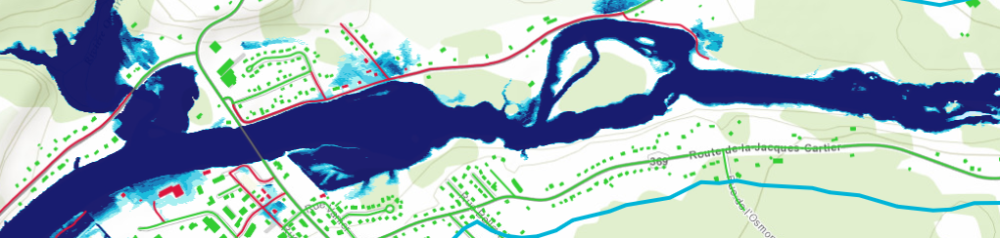

# MERIGE

  

MERIGE est une méthode d'évaluation du risque lié aux inondations développée par le [Département de génie des eaux de l'Université Laval](https://www.gci.ulaval.ca/) dans le cadre d'un projet financé par le ministère de la Sécurité intérieure du Québec.

Cet espace comprend les outils développés pour l'application de cette méthode. 

## Dépôts principaux 
*   `merige`: bibliothèque Python pour le calcul des métriques de MERIGE. (Actuellement en développement privé.)

## Contact
Pour toute question concernant la méthodologie ou l'accès au code, veuillez [ouvrir une discussion](https://github.com/orgs/outils-merige/discussions/) dans ce répertoire.

---

*Welcome to the official organization for MERIGE flood risk assessment tools, developed at Laval University in partnership with the ministère de la Sécurité intérieure du Québec.*

*For any question regarding the methodology or to request private access, please contact us by [opening a discussion](https://github.com/orgs/outils-merige/discussions/) in this repository.*

